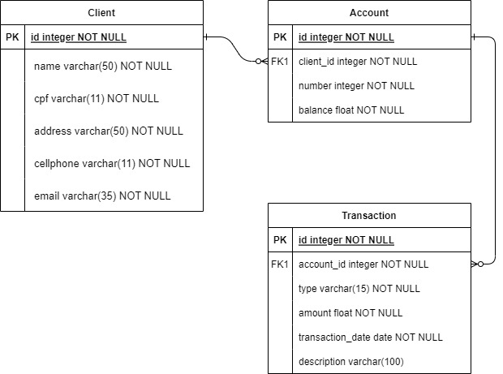
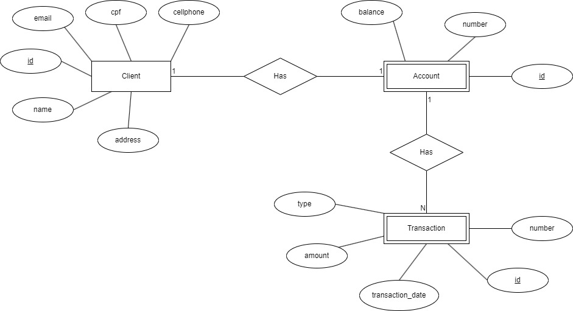

<h1 align="center">
    💱 <a href="#"> BTG Pactual - Conta Digital </a>
</h1>

<h3 align="center">
    API de Sistema de Conta Digitais
</h3>

<h4 align="center">
	Em andamento 🚀
</h4>

Tabela de conteúdos
=================
<!--ts-->
* [Sobre o projeto](#-sobre-o-projeto)
* [Funcionalidades](#-funcionalidades)
* [Modelagem da Entidades e Relacionamentos](#-modelagem-de-entidades-e-relacionamentos)
	* [Modelo Entidade Relacionamento](#-modelo-entidade-relacionamento)
	* [Diagrama Entidade Relacionamento](#-diagrama-entidade-relacionamento)
* [Tecnologias](#-tecnologias)
* [Contribuidores](#-contribuidores)
<!--te-->

## 💻 Sobre o projeto

💱 O projeto é um desafio técnico para a empresa BTG Pactual que consiste na criação de um sistema de contas digitais contendo entidades básicas como cliente, conta e movimentações e os métodos de cada entidade. 
No projeto foi utilizado framework Spring Boot e o banco de dados utilizado foi o PostgreSQL

## Modelagem da Entidades e Relacionamentos

## Modelo Entidade Relacionamento
- O Modelo Entidade Relacionamento (MER) é usado para representar as entidades, seus atributos e relacionamentos 

## Diagrama Entidade Relacionamento
- O Diagrama Entidade Relacionamento (DER) é a representação gráfica das entidades e seus relacionamentos

---

## ⚙️ Funcionalidades #funcionalidades

- Cadastro e atualização de clientes
- Cadastro e atualização de contas
- Consulta de contas e clientes
- Consulta de contas de clientes
- Consulta por movimentações de uma conta
- Adição de saldo à conta (Depósito)
- Remoção de saldo da conta (Saque)

---

## 🛠 Tecnologias

As seguintes ferramentas foram usadas na construção do projeto:

#### **Website**  ([Java](https://www.oracle.com/br/java/technologies/downloads/)  +  [Postgres](https://www.postgresql.org/))

---

## 👨‍💻 Contribuidores

    wyan
---
